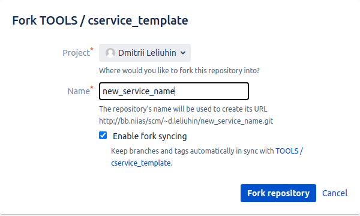

# FAQ

List of common questions with answers.

---

⌦ **Why is this repository needed?**

The repository is designed as a microservice template for working with zcm data. 
I always wanted to have one at hand, since literally all of them are repeated. 
Of the nice things are scripts for self-documentation and application testing with reporting generation.

---

⌦ **To create a new repository, I will have to manually change its name in all files, where does it appear?**

No, you don't have to. For this, a custom [script](../scripts/rename.sh) has been created to auto-replace the old project name with the new one.

---

⌦ **How can I create my project based on the current template repository?**

To do this, you need to:

- Fork repo and replace string in ***Name*** field as you wish. Change ***Project*** if you want.



- Clone new repo from *bb.niias/* :

```
git clone ssh://git@bb.niias:7999/~d.leliuhin/new_service_name.git
cd new_service_name
git checkout develop

```

- Replace all cservice_template entries by new with preview:

```
./scripts/rename.sh cservice_template new_service_name
```

- Result should be:
```
--@--:~/Desktop/template/new_service_name$ ./scripts/rename.sh cservice_template new_service_name
Replacement from cservice_template to new_service_name done
```

- View the changelog:

```
--@--:~/Desktop/template/new_service_name$ git status
On branch develop
Your branch is up to date with 'origin/develop'.

Changes not staged for commit:
  (use "git add <file>..." to update what will be committed)
  (use "git restore <file>..." to discard changes in working directory)
	modified:   CMakeLists.txt
	modified:   README.md
	modified:   cfg/cfg.cmake
	modified:   doc/CONTRIBUTING.md
	modified:   doc/Doxyfile
	modified:   doc/README.md
	modified:   scripts/README.md
	modified:   scripts/refresh.sh
	modified:   scripts/run.sh
	modified:   scripts/test.sh
	modified:   src/main.cpp
	modified:   tests/CMakeLists.txt
	modified:   tests/README.md

no changes added to commit (use "git add" and/or "git commit -a")

```

- Push new changes to git:

```
git add .
git commit -m "Init. Repo."
git push origin develop
```

---