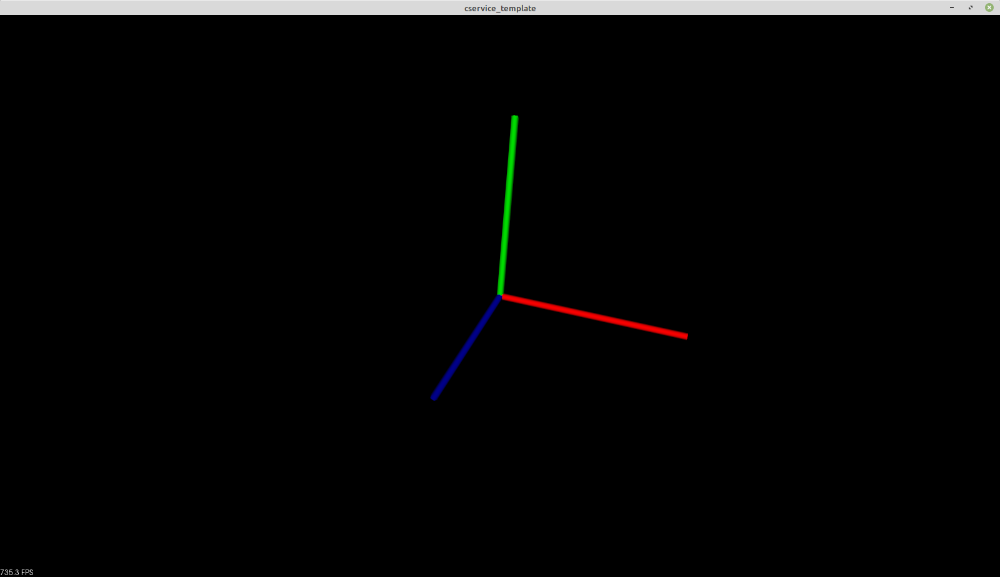
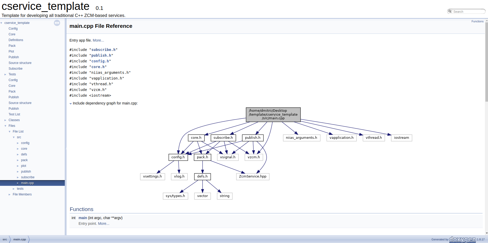

# Visualization

Extended service documentation.

---



---

Start doxygen code autodoc:<br/>

```
cd cservice_template
git checkout release
./scripts/doc.sh
```

---

Doxygen result located in: *./doc/doxygen/html*

Main page is - *./doc/doxygen/html/index.html*

To visualize open in browser you prefer or:
```
firefox ./doc/doxygen/html/index.html
```


---