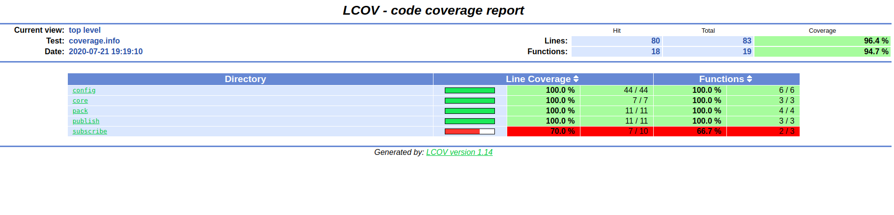

# Tests

---

## Physical

List of physical tests (necessary when developing drivers for sensors).

---

## Imitation

List of imitation tests (necessary when developing drivers for sensors).

---

## Unit

Start unit tests with code coverage:<br/>

```
cd cservice_template
git checkout release
./scripts/test.sh
```

Code coverage manually:
```
./scripts/coverage.sh
```
---

Code coverage result located in: *./doc/coverage*

Main page is - *./doc/coverage/index.html*

To visualize open in browser you prefer or:
```
firefox ./doc/coverage/index.html
```


---
